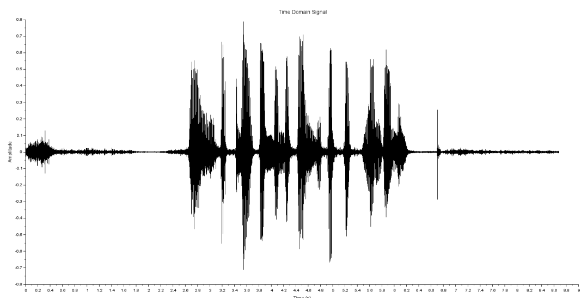
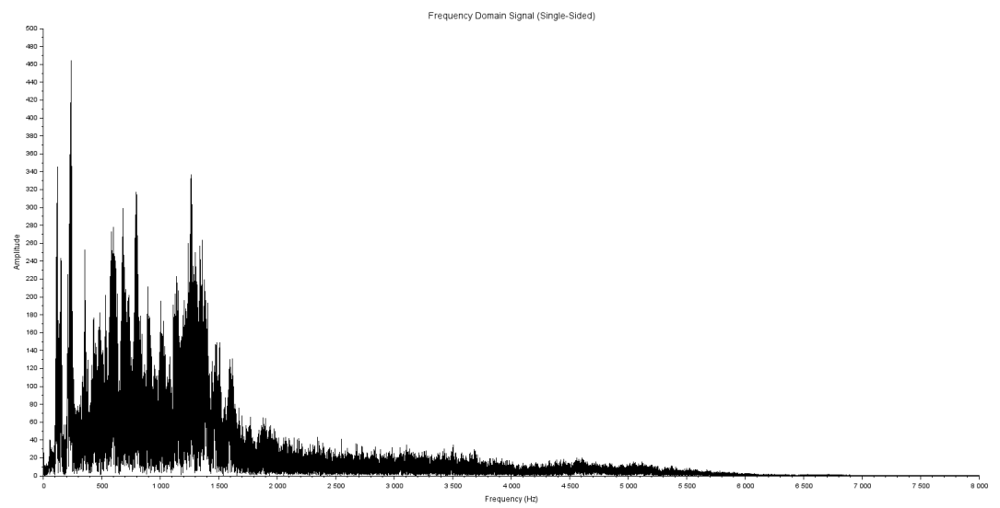
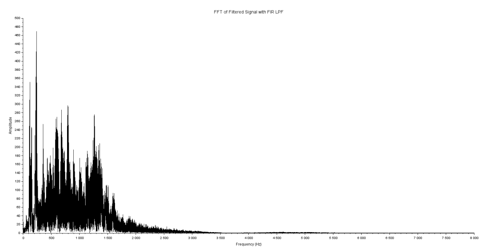
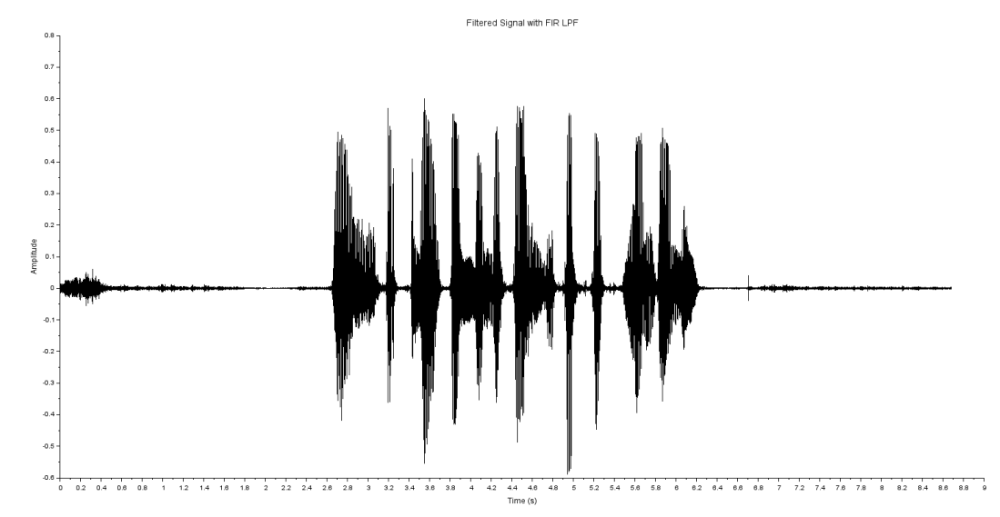

# Audio Signal Filtering

This repository contains a project for processing audio signals using Scilab. The project demonstrates various signal filtering techniques and their implementation in Scilab.

## Features
- Implementation of basic audio signal processing techniques.
- Application of filters such as low-pass, high-pass, and band-pass.
- Visualization of audio signals before and after filtering.

## Requirements
- Scilab (version 6.0 or higher)
- Basic knowledge of signal processing concepts.

## Clone the repository
   ```bash
   git clone https://github.com/yourusername/audio_signal_filtering.git
   ```

## Step 1: Original Signal (Before Filtering)
This is the original audio signal before any filtering is applied:


## Step 2: Transform to Frequency Domain using FFT
This is the result after transform to frequency domain using FFT:


## Step 3: Filtering Signal using Low Pass Filter
This is the result after applying the Low Pass Filter to the audio signal:


## Step 4: Filtered Signal (After Filtering)
This is the audio signal after any filtering is applied:


## Comparison of Results
Here is a comparison of the signal before and after filtering:

### Before Filtering


### After Filtering


## How It Works
The signal is first transformed into the frequency domain using FFT, filtered with a low pass filter, and then transformed back to the time domain. The following images illustrate each stage:
1. **Original Signal**
2. **Frequency Domain**
3. **Filtered Signal**
4. **Time Domain (After Filtering)**


